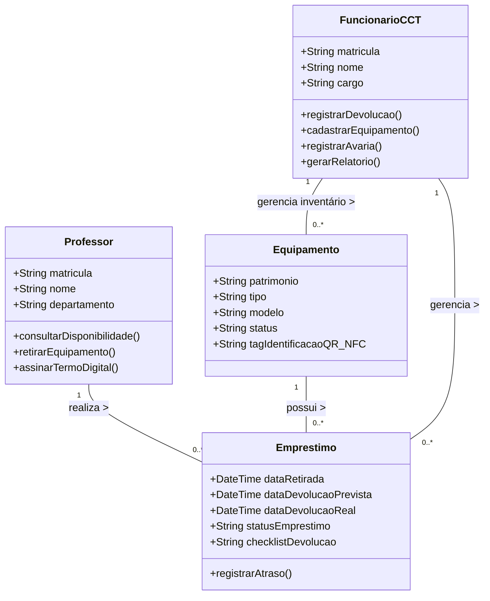

### Diagrama de Classes (UML)

```mermaid
classDiagram
    %% Definição da classe Professor
    class Professor {
        +String matricula
        +String nome
        +String departamento
        +consultarDisponibilidade()
        +retirarEquipamento()
        +assinarTermoDigital()
    }

    %% Definição da classe Equipamento (Ativo)
    class Equipamento {
        +String patrimonio
        +String tipo
        +String modelo
        +String status
        +String tagIdentificacaoQR_NFC
    }

    %% Definição da classe Emprestimo (Registro da transação)
    class Emprestimo {
        +DateTime dataRetirada
        +DateTime dataDevolucaoPrevista
        +DateTime dataDevolucaoReal
        +String statusEmprestimo
        +String checklistDevolucao
        +registrarAtraso()
    }

    %% Definição da classe Funcionario CCT (Atendente / Administrador)
    class FuncionarioCCT {
        +String matricula
        +String nome
        +String cargo
        +registrarDevolucao()
        +cadastrarEquipamento()
        +registrarAvaria()
        +gerarRelatorio()
    }

    %% Relacionamentos
    Professor "1" -- "0..*" Emprestimo : realiza >
    Equipamento "1" -- "0..*" Emprestimo : possui >
    FuncionarioCCT "1" -- "0..*" Emprestimo : gerencia >
    FuncionarioCCT "1" -- "0..*" Equipamento : gerencia inventário >
```

--------------------------------------------------------------------------------
