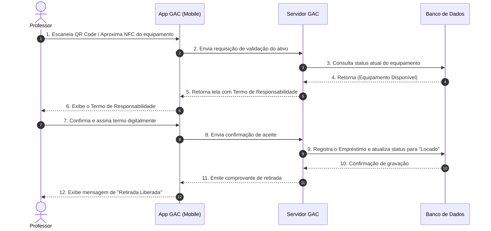

### Diagrama de Sequência (UML) - Fluxo de Retirada de Equipamento

```mermaid
sequenceDiagram
    autonumber
    
    %% Atores e Componentes
    actor P as Professor
    participant App as App GAC (Mobile)
    participant Sist as Servidor GAC
    participant BD as Banco de Dados

    %% Passo a passo do fluxo
    P->>App: 1. Escaneia QR Code / Aproxima NFC do equipamento
    App->>Sist: 2. Envia requisição de validação do ativo
    Sist->>BD: 3. Consulta status atual do equipamento
    BD-->>Sist: 4. Retorna (Equipamento Disponível)
    Sist-->>App: 5. Retorna tela com Termo de Responsabilidade
    App-->>P: 6. Exibe o Termo de Responsabilidade
    P->>App: 7. Confirma e assina termo digitalmente
    App->>Sist: 8. Envia confirmação de aceite
    Sist->>BD: 9. Registra o Empréstimo e atualiza status para "Locado"
    BD-->>Sist: 10. Confirmação de gravação
    Sist-->>App: 11. Emite comprovante de retirada
    App-->>P: 12. Exibe mensagem de "Retirada Liberada"
```
