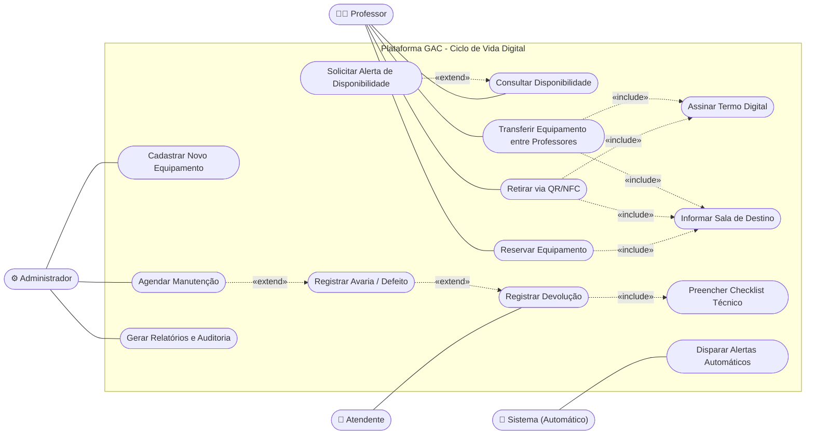

### Diagrama de Casos de Uso (UML) - Visão Detalhada

```mermaid
flowchart LR
    %% Atores
    Prof(["👨‍🏫 Professor"])
    Atend(["💁 Atendente"])
    Admin(["⚙️ Administrador"])
    Sis(["🤖 Sistema (Automático)"])

    %% Sistema (GAC)
    subgraph Sistema [Plataforma GAC - Ciclo de Vida Digital]
        direction TB
        
        %% Ações de Consulta e Alerta
        UC1([Consultar Disponibilidade])
        UC1a([Solicitar Alerta de Disponibilidade])
        
        %% Ações de Uso do Equipamento
        UC2([Reservar Equipamento])
        UC3([Retirar via QR/NFC])
        UC4([Transferir Equipamento entre Professores])
        
        %% Ações de Segurança e Rastreabilidade
        UC5([Assinar Termo Digital])
        UC6([Informar Sala de Destino])
        
        %% Ações do Atendente
        UC7([Registrar Devolução])
        UC8([Preencher Checklist Técnico])
        UC9([Registrar Avaria / Defeito])
        
        %% Ações da Gestão
        UC10([Cadastrar Novo Equipamento])
        UC11([Agendar Manutenção])
        UC12([Gerar Relatórios e Auditoria])
        
        %% Ações do Sistema
        UC13([Disparar Alertas Automáticos])
    end

    %% Conectando os Atores
    Prof --- UC1
    Prof --- UC2
    Prof --- UC3
    Prof --- UC4
    
    Atend --- UC7
    
    Admin --- UC10
    Admin --- UC11
    Admin --- UC12
    
    Sis --- UC13

    %% Regras de Sem Disponibilidade (Opcional)
    UC1a -.->|«extend»| UC1

    %% Regras de Sala de Destino (Obrigatório)
    UC2 -.->|«include»| UC6
    UC3 -.->|«include»| UC6
    UC4 -.->|«include»| UC6

    %% Regras de Termo Digital (Obrigatório)
    UC3 -.->|«include»| UC5
    UC4 -.->|«include»| UC5

    %% Regras de Devolução
    UC7 -.->|«include»| UC8
    UC9 -.->|«extend»| UC7
    UC11 -.->|«extend»| UC9
```
