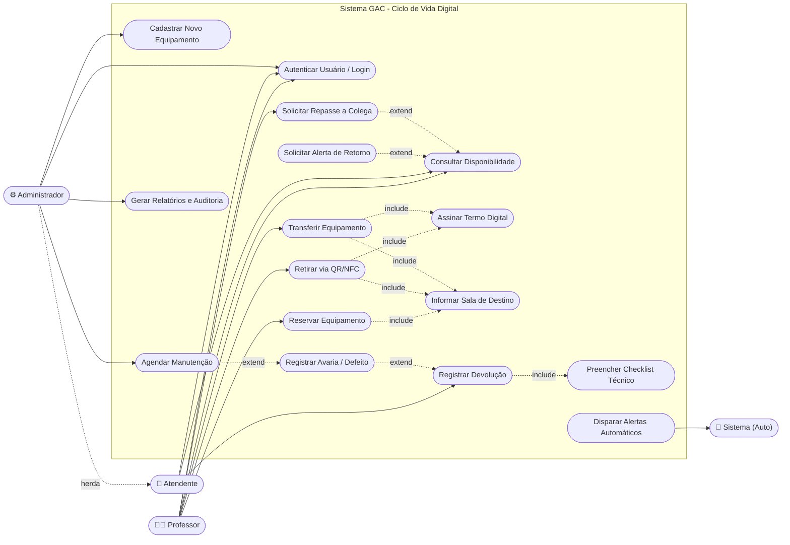

```mermaid
flowchart LR
    %% Atores da Esquerda
    Prof(["👨‍🏫 Professor"])
    Atend(["💁 Atendente"])
    Admin(["⚙️ Administrador"])

    subgraph Plataforma_GAC ["Sistema GAC - Ciclo de Vida Digital"]
        direction TB
        Login(["Autenticar Usuário / Login"])
        Consultar(["Consultar Disponibilidade"])
        Alerta(["Solicitar Alerta de Retorno"])
        SolicitarRepasse(["Solicitar Repasse a Colega"])
        Reservar(["Reservar Equipamento"])
        Retirar(["Retirar via QR/NFC"])
        Transferir(["Transferir Equipamento"])
        Termo(["Assinar Termo Digital"])
        Sala(["Informar Sala de Destino"])
        Devolver(["Registrar Devolução"])
        Checklist(["Preencher Checklist Técnico"])
        Avaria(["Registrar Avaria / Defeito"])
        Cadastrar(["Cadastrar Novo Equipamento"])
        Manutencao(["Agendar Manutenção"])
        Relatorios(["Gerar Relatórios e Auditoria"])
        AlertasAuto(["Disparar Alertas Automáticos"])
    end

    %% Ator da Direita
    Sis(["🤖 Sistema (Auto)"])

    %% Ligações Principais
    Prof --> Login
    Prof --> Consultar
    Prof --> SolicitarRepasse
    Prof --> Reservar
    Prof --> Retirar
    Prof --> Transferir
    
    Atend --> Login
    Atend --> Consultar
    Atend --> Devolver
    
    Admin --> Login
    Admin --> Cadastrar
    Admin --> Manutencao
    Admin --> Relatorios

    %% O Sistema Automático
    AlertasAuto --> Sis

    %% Herança do Administrador
    Admin -.->|herda| Atend

    %% Relacionamentos Internos (Includes e Extends)
    Alerta -.->|extend| Consultar
    SolicitarRepasse -.->|extend| Consultar
    
    Reservar -.->|include| Sala
    Retirar -.->|include| Sala
    Transferir -.->|include| Sala
    
    Retirar -.->|include| Termo
    Transferir -.->|include| Termo

    Devolver -.->|include| Checklist
    Avaria -.->|extend| Devolver
    Manutencao -.->|extend| Avaria
```
